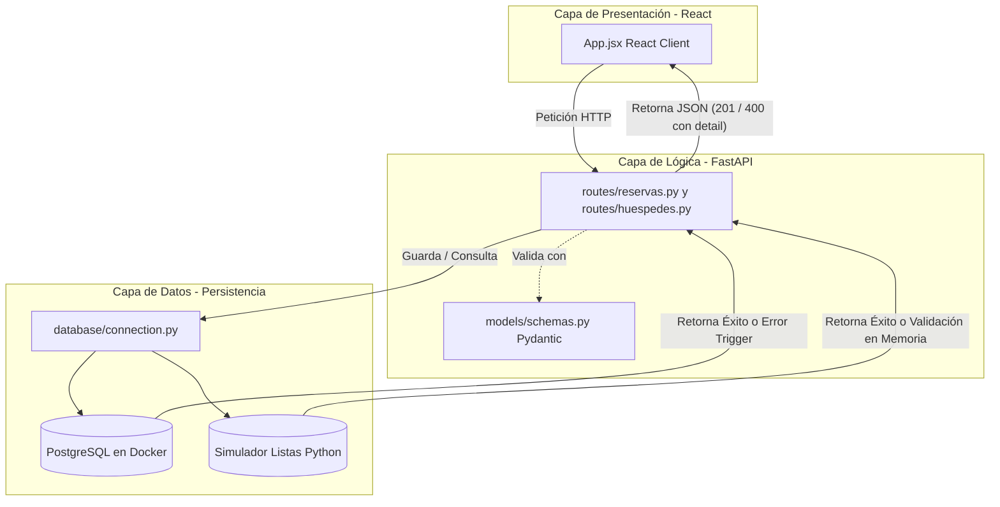

> **Pregunta:** ¿Cuál es la estructura física de directorios y la arquitectura del sistema que tomamos a nivel de backend y frontend para el registro y reservas?

# Estructura del Proyecto: Registro y Reservas (FastAPI)

Este documento detalla la estructura física de archivos y la correspondencia conceptual con la **Arquitectura Monolítica de 3 Capas** para el flujo integrado de **Registro y Reservas** de **BookingSoft**, adaptado al nivel de **SENA ADSO T4** en tu entorno **Antigravity IDE**.

---

## 📂 Árbol de Directorios del Proyecto

El backend se organiza de forma modular y limpia, separando la conexión, la lógica de rutas y los esquemas de validación en carpetas independientes para evitar el desorden:

```text
aPARTAHOTEL/
├── docker-compose.yml       # Define el contenedor PostgreSQL
├── propuesta_tecnica.md     # Documento de requisitos del sistema (SENA)
├── BookingSoft.postman_collection.json # Colección de pruebas HTTP en Postman
│
├── backend/                 # CAPA DE NEGOCIO Y PERSISTENCIA (FastAPI)
│   ├── main.py              # Archivo de arranque, CORS e inclusión de routers
│   ├── schema.sql           # Estructura DDL (PostgreSQL), Triggers y Funciones
│   ├── requirements.txt     # Dependencias de Python
│   ├── .env                 # Variables de entorno confidenciales
│   │
│   ├── database/            # Conector de persistencia
│   │   └── connection.py    # Conexión JDBC/psycopg2 y listas en memoria
│   │
│   ├── models/              # Modelos de datos
│   │   └── schemas.py       # Esquemas de validación Pydantic
│   │
│   └── routes/              # Controladores y rutas HTTP
│       ├── habitaciones.py  # Controlador de catálogo
│       ├── huespedes.py     # Controlador de registro y listado de clientes
│       └── reservas.py      # Controlador de creación y consulta de reservas
│
└── frontend/                # CAPA DE PRESENTACIÓN (Interfaz web en React)
    ├── vite.config.js       # Configuración de compilación y Proxy de API REST
    ├── index.html           # Plantilla HTML con las fuentes Outfit e Inter
    ├── package.json         # Scripts y dependencias de React
    └── src/
        ├── main.jsx         # Punto de arranque y renderizado de React
        ├── App.jsx          # UI de dos pasos (Registro de Huésped, Reserva y Tablas en vivo)
        └── index.css        # Estilos en CSS Vanilla (Glassmorphism de la marca)
```

---

## 🏗️ Mapeo Conceptual a la "Arquitectura Monolítica de 3 Capas"

La división física del código responde directamente a los conceptos de la **Arquitectura de 3 Capas**:

1.  **Capa de Presentación (Cliente):**
    *   Ubicada en `frontend/` (React). Captura los datos ingresados por el usuario, valida la casilla legal de Habeas Data y dibuja las tablas en tiempo real.
2.  **Capa de Lógica de Negocio (Backend):**
    *   Ubicada en `backend/routes/` y `backend/models/`. Valida los tipos de datos de entrada, calcula el **15% de descuento por larga estadía** y valida que no haya colisiones de fechas antes de guardar la reserva.
3.  **Capa de Datos (Persistencia):**
    *   Ubicada en `backend/database/` y en el servidor **PostgreSQL** de Docker (con su trigger `trg_validar_double_booking`). En caso offline, el archivo `connection.py` simula la persistencia mediante listas de memoria (`huespedes_simulacion`, `reservas_simulacion`).


