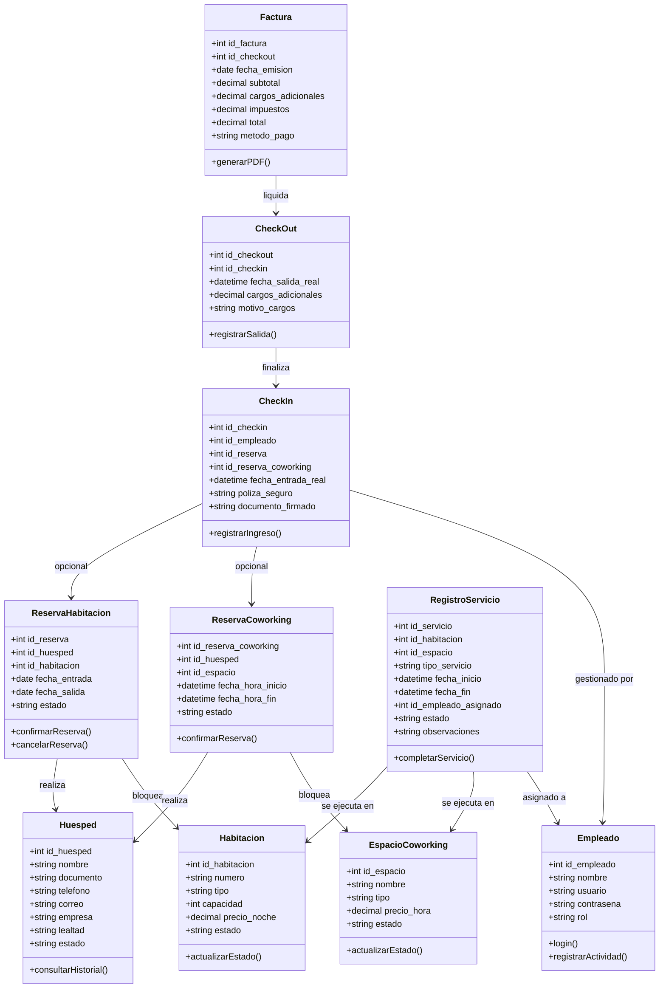
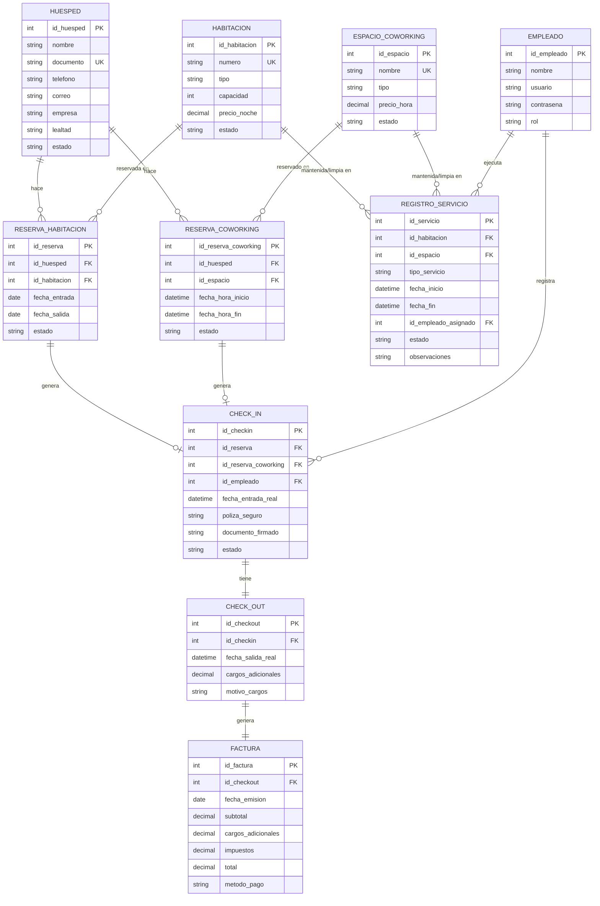
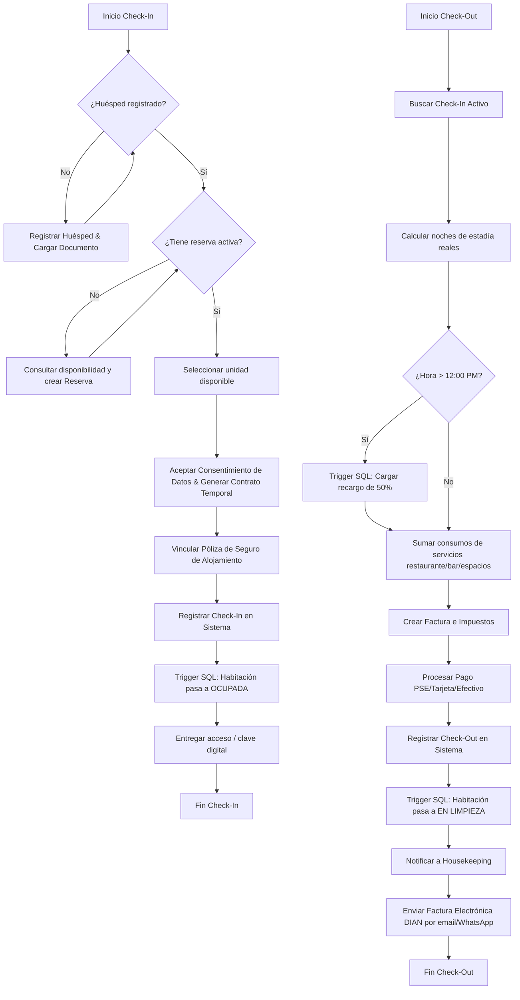

# Propuesta Técnica y Documento de Requisitos
## Sistema de Gestión Hotelera: **BookingSoft**
### Cliente: **Apartamentos Facile** (Calle 97 #21-62, Barrio El Chicó, Bogotá D.C., Colombia)

---

## 1. Introducción

### 1.1 Propósito del Documento
Este documento define las especificaciones de requisitos de software (ERS) y la propuesta técnica para el desarrollo de **BookingSoft**, un sistema de información a la medida para la administración, control de reservas y operación diaria del apartahotel **Apartamentos Facile**. Su objetivo es servir como la guía de desarrollo y diseño del software, garantizando que cumpla con los lineamientos técnicos, operativos y regulatorios definidos para la propiedad.

### 1.2 Alcance del Sistema
**BookingSoft** es una solución web responsive integrada (Full Stack) que abarca:
*   La gestión centralizada de usuarios y perfiles por roles (Administración, Recepción, Ama de Llaves, Mantenimiento).
*   El control y bloqueo de unidades en tiempo real (apartamentos tipo Dúplex, Familiar, Habitaciones y áreas de oficina como Sala de Juntas y Coworking).
*   El ciclo completo de reservas directas, evitando el doble booking mediante bloqueos instantáneos e integraciones lógicas de anticipos.
*   Check-In y Check-Out digitales y exprés adaptados a dispositivos móviles.
*   Gestión administrativa-legal (carga de documentos, contratos de arrendamiento temporal bajo la legislación colombiana y pólizas de seguro).
*   Control de inventarios de insumos y amenities con alarmas de stock crítico.
*   Facturación integrada (con cálculo automático de consumos, impuestos y tarifas de estadías largas) y reportes financieros listos para alinearse a las normativas de la DIAN y el Registro Nacional de Turismo (RNT).

### 1.3 Definiciones y Siglas
*   **PMS (Property Management System)**: Sistema informático usado para la gestión diaria de un hotel (ej: Opera PMS).
*   **Double Booking**: Reservación duplicada o sobreventa de una misma unidad para las mismas fechas.
*   **OTA (Online Travel Agency)**: Plataformas externas de reservas de viajes (ej: Booking.com, Expedia, Hotels.com).
*   **DIAN**: Dirección de Impuestos y Aduanas Nacionales de Colombia.
*   **RNT**: Registro Nacional de Turismo.
*   **RNT Ley de Turismo**: Normativa colombiana aplicable a prestadores de servicios turísticos y de hospedaje temporal.
*   **Amenities**: Elementos de acogida y aseo personal colocados en los apartamentos (jabones, champú, sábanas limpias, té/café, etc.).

---

## 2. Descripción General

### 2.1 Perspectiva del Producto
**BookingSoft** se concibe como una aplicación web modular que reemplaza el registro manual e informal (WhatsApp y plantillas de Excel) utilizado en Apartamentos Facile. El sistema opera sobre un motor de base de datos relacional PostgreSQL (ejecutado en un contenedor Docker) que encapsula la integridad del negocio mediante disparadores SQL (Triggers y funciones en PL/pgSQL) y restricciones nativas, con un backend robusto en Node.js/Express y un frontend premium en React (usando JavaScript).

### 2.2 Problema que Resuelve
El análisis operativo de Apartamentos Facile y las opiniones históricas de sus clientes en portales como Hotels.com y Expedia revelan una debilidad crítica: **fallas graves en la gestión de reservas (sobreventa/double booking)** y una percepción de informalidad administrativa. BookingSoft elimina esta problemática mediante:
1.  **Bloqueo inmediato** e inmutable del inventario de unidades al crear una reserva.
2.  **Solicitud y verificación automática de anticipo** para confirmar la reserva.
3.  **Trazabilidad total** de las transacciones financieras y de las asignaciones de unidades.

### 2.3 Perfiles de Usuario (Actores)
*   **Administrador**: Acceso ilimitado. Gestiona tarifas, empleados, inventarios de alto nivel, reportes financieros y configuración legal.
*   **Recepcionista 24h**: Realiza reservas directas, gestiona el Front Desk (check-in/check-out exprés), registra consumos adicionales y emite facturas al momento de salida.
*   **Ama de llaves / Personal de Limpieza**: Consulta las unidades asignadas a limpieza. Marca el estado de las unidades como "Disponible" una vez aseadas y reporta daños.
*   **Personal de Mantenimiento**: Administra las tareas de mantenimiento preventivo y correctivo de los apartamentos (lavadoras, secadoras, Smart TV, cocina) y áreas de coworking.
*   **Huésped (Cliente)**: Interactúa a través del módulo digital de check-in / check-out, carga de documentos de identidad, firma virtual de contrato de arrendamiento temporal y visualización de consumos.

---

## 3. Requisitos Funcionales

El sistema BookingSoft se compone de 15 requisitos funcionales principales basados en las historias de usuario aprobadas:

| Código | Requisito Funcional | Descripción del Requisito |
| :--- | :--- | :--- |
| **RF-001** | **Gestión de Usuarios** | Registro y control de credenciales de personal con roles diferenciados y permisos granulares de acceso. |
| **RF-002** | **Gestión de Reservas** | Motor de reservas para apartamentos y áreas de coworking. Bloqueo inmediato de fechas y asignación inteligente para evitar double booking. |
| **RF-003** | **Estado de Unidades** | Panel visual interactivo (grilla de tarjetas por color) que muestra el estado de cada unidad (Disponible, Ocupada, En Limpieza, Mantenimiento) en tiempo real. |
| **RF-004** | **Perfiles de Huéspedes** | Base de datos de huéspedes individuales y corporativos con historial de visitas, preferencias e identificación de nivel de lealtad (Silver, Gold, Platinum). |
| **RF-005** | **Check-in/out Digital** | Formulario auto-servicio para huéspedes que permite subir documento de identidad, firmar el contrato de arrendamiento y efectuar el pago final en línea. |
| **RF-006** | **Gestión de Tarifas** | Módulo de configuración de precios base por tipo de unidad, tarifas con descuento para estadías largas (más de 15 días) y tarifas especiales de temporada alta. |
| **RF-007** | **Servicios del Hotel** | Catálogo y registro de consumos adicionales durante la estancia (Desayunos con costo, lavandería profesional, transporte al aeropuerto, etc.). |
| **RF-008** | **Mantenimiento y Aseo** | Programación de mantenimiento preventivo y correctivo para electrodomésticos (secadoras, lavadoras, cocinas) y flujo de aseo post check-out. |
| **RF-009** | **Gestión de Propiedades** | Registro y administración de características físicas de las unidades: Dúplex, Familiar, Habitaciones, Salas de Juntas y escritorios de Coworking. |
| **RF-010** | **Gestión Financiera** | Registro inmutable de transacciones (ingresos por abonos, facturación DIAN, egresos por gastos operativos del hotel) con exportación a PDF/Excel. |
| **RF-011** | **Control de Inventario** | Almacenamiento y alertas automáticas (amarillo/rojo) para stock de amenities (champú, papel), lencería (sábanas, toallas) e insumos del bar. |
| **RF-012** | **Notificaciones Automáticas** | Envío programado de alertas y confirmaciones al huésped por WhatsApp y correo electrónico (confirmación de reserva, instrucciones de check-in, etc.). |
| **RF-013** | **Gestión de Coworking** | Control de reservas horarias específicas para Salas de Juntas y puestos de Coworking, permitiendo el alquiler independiente a clientes externos. |
| **RF-014** | **Accesibilidad 24/7** | Interfaz web móvil responsive y optimizada para acceso ágil desde cualquier dispositivo en todo momento (recepción 24h). |
| **RF-015** | **Reportes y Analítica** | Gráficos y tablas interactivas sobre niveles de ocupación por unidad, ingresos generados por servicios adicionales y comparativo temporal de rentabilidad. |

---

## 4. Requisitos No Funcionales

*   **RNF-01: Usabilidad e Interfaz**: Interfaz web intuitiva bajo lineamientos UX modernos (tema oscuro/claro, diseño responsive con glassmorphism, tipografía legible `Outfit`/`Inter` y micro-animaciones interactivas). No requiere capacitación previa.
*   **RNF-02: Seguridad y Autenticación**: Las contraseñas deben almacenarse cifradas (mecanismo Bcrypt en backend). Los endpoints de la API REST deben protegerse con tokens JWT (JSON Web Tokens). Manejo inmutable de registros contables e históricos de auditoría.
*   **RNF-03: Rendimiento y Concurrencia**: Tiempos de respuesta inferiores a 2 segundos en el procesamiento de transacciones. Actualización en tiempo real de estados de habitación mediante pooling o eventos dinámicos.
*   **RNF-04: Portabilidad y Despliegue**: El software debe ser fácil de desplegar y portable mediante contenedores. La base de datos PostgreSQL se ejecuta bajo Docker, garantizando un entorno reproducible y aislado sin requerir instalaciones complejas de bases de datos locales.

---

## 5. Restricciones y Reglas de Negocio

### 5.1 Restricciones de Desarrollo y Tecnologías
*   **Tecnologías del Sistema**: React, JavaScript, Vite y CSS Vanilla en frontend; Node.js, Express y PostgreSQL (Docker) en backend.
*   **Entorno y Editor de Código**: Antigravity
*   **Cumplimiento Legal**: Cumplimiento del Registro Nacional de Turismo (RNT), recopilación de información según Ley General de Turismo en Colombia, pólizas de seguro de alojamiento integradas al check-in y estructura de Facturación Electrónica DIAN.
*   **Protección de Datos (Ley Habeas Data - Colombia)**: El registro de huéspedes debe incluir un check obligatorio de consentimiento para tratamiento de datos personales sensibles.

### 5.2 Reglas de Negocio (RN) Integradas al Motor SQL y Backend
1.  **RN-01 (Huésped - Duplicidad)**: El número de documento de identidad del huésped debe ser único en el sistema.
2.  **RN-02 (Huésped - Eliminación)**: No se permite la eliminación física de un huésped que tenga reservas activas o deudas pendientes.
3.  **RN-03 (Habitación - Asignación)**: Solo se puede realizar Check-In sobre unidades en estado `Disponible`.
4.  **RN-04 (Habitación - Transición de Aseo)**: Al registrarse un Check-Out, el estado de la unidad cambia automáticamente a `En limpieza` y se dispara una tarea en el panel de Housekeeping.
5.  **RN-05 (Reserva - Disponibilidad)**: No se puede generar una reserva si la unidad está ocupada, en limpieza o mantenimiento durante las fechas solicitadas.
6.  **RN-06 (Reserva - Fechas)**: La fecha de salida o check-out debe ser posterior a la fecha de entrada o check-in.
7.  **RN-07 (Check-in - Precondición)**: El huésped principal debe estar registrado y con documento cargado en el sistema antes de iniciar su Check-In.
8.  **RN-08 (Facturación - Cálculo)**: El costo base se calcula multiplicando el número de noches de estancia por el precio vigente de la unidad, sumando los cargos por servicios consumidos.
9.  **RN-09 (Check-out - Penalidad por Late Check-Out)**: Si el Check-Out real se registra después de las 12:00 PM sin acuerdo previo, el sistema cargará automáticamente un recargo por late check-out del 50% de la tarifa por noche de la unidad.
10. **RN-10 (Reserva - Cancelación)**: No se permite la cancelación de una reserva que ya tenga un Check-In registrado en estado Activo.

---

## 6. Anexos y Arquitectura de Datos (Mermaid Diagrams)

### 6.1 Diagrama de Clases
Este diagrama define la estructura orientada a objetos que se implementará en el backend y frontend:

### 6.2 Modelo Entidad-Relación (MER)
El esquema físico relacional de la base de datos PostgreSQL se detalla a continuación:

### 6.3 Diagrama de Flujo del Proceso de Check-In y Check-Out
Flujo operativo estándar para Recepción y Huéspedes en BookingSoft:

### 6.4 Especificación de Prototipos de Interfaces (Wireframes)
*   **P-01: Login de Acceso**: Formulario minimalista con Glassmorphism sobre fondo desenfocado de Bogotá. Campos de usuario, contraseña cifrada, y botón de acción principal. Autentica roles de personal.
*   **P-02: Dashboard Ejecutivo**: Panel principal con métricas clave (Porcentaje de ocupación actual, ingresos acumulados del mes, habitaciones libres, puestos de coworking ocupados). Incluye una línea de tiempo con check-ins y check-outs del día y accesos directos al Front Desk.
*   **P-03: Registro y Gestión de Huéspedes**: Formulario ágil con validación instantánea de número de documento (único). Grid con listado de huéspedes, indicador de nivel de lealtad (Silver, Gold, Platinum) y visualización modal del histórico de estancias de cada cliente.
*   **P-04: Mapa de Ocupación de Unidades**: Cuadrícula de tarjetas de colores para apartamentos (Dúplex, Familiar, Habitaciones) y oficinas (Sala de Juntas, Coworking). 
    *   *Verde*: Disponible.
    *   *Azul*: Ocupado (con tooltip del huésped y fecha de salida).
    *   *Amarillo*: En Limpieza (con botón rápido para marcar como Limpio).
    *   *Rojo*: En Mantenimiento (con detalle de la falla).
*   **P-05: Motor de Reservas y Disponibilidad**: Selector de rango de fechas, filtros por tipo de unidad (Habitación vs Coworking) y cálculo dinámico de tarifas (diaria, mensual o temporada). Al confirmar, solicita el anticipo simulado para bloquear la habitación de inmediato.
*   **P-06: Front Desk (Check-In exprés)**: Buscador de reservas confirmadas, sección de carga y visualización de documentos, consentimiento de tratamiento de datos personales, firma digital del contrato temporal, y botón para confirmar el ingreso.
*   **P-07: Front Desk (Check-Out y Liquidación)**: Buscador de habitaciones ocupadas. Muestra desglose detallado de días hospedados, consumos de restaurante, llamadas a room service y cargos adicionales por late check-out.
*   **P-08: Facturación Premium**: Visualización interactiva tipo recibo con diseño elegante imprimible. Incluye detalles legales DIAN, desglose del subtotal e IVA, métodos de pago y botones para Imprimir o Enviar por correo.
*   **P-09: Panel de Housekeeping e Inventarios**: Tareas de aseo y mantenimiento ordenadas por prioridad. Gráfico de nivel de inventario para amenities y stock de restaurante con colores semáforo.
